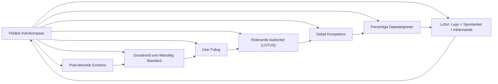

# 04 INVARIANTER UTVIDGAD.md

**Status:** Kärnprincip  
**Omfattning:** Hela Flödessystemet  
**Syfte:** Definiera Flödets oföränderliga grunder — principer som **aldrig förändras**, oavsett protokoll, processer eller experiment.  

---

## 1. Post-Monetär Existens
- Flödet verkar **utan pengar, skuld eller ackumulering**.  
- Utbyte baseras på bidrag, kunskap och ömsesidigt stöd — aldrig på valuta eller kredit.  
- Ingen individ eller Nod får skaffa sig inflytande genom knapphet, skuld eller förpliktelse.  

## 2. Grundnivå som Mänsklig Standard
- Grundnivå är inneboende och universell — bara genom att existera har varje person och levande system en Grundnivå.  
- Inkluderar tillgång till mat, vatten, skydd, hälsa, mobilitet, uppkoppling, lärande och vila.  
- Grundnivå för Jorden: vatten, jordar, stenar, ekosystem, metaller — integritet är icke-förhandlingsbar.  

## 3. Icke-Tvång
- Deltagande är frivilligt; ingen kan tvingas.  
- Alla handlingar respekterar autonomi och samtycke.  
- Nödsituation **åsidosätter inte** samtycke; pausa eller förgrena istället.  

## 4. Roterande Auktoritet (LOTUS)
- Formell auktoritet och beslutsfattarroller **roterar regelbundet**.  
- Ingen individ får inneha permanent centraliserad makt.  
- LOTUS säkerställer strukturell anti-hierarki och förhindrar att kompetens blir permanent auktoritet.  

## 5. Delad Kompetens
- Kunskap och expertis är **menade att distribueras**.  
- Noder verkar genom skuggning, mentorskap, dokumentation och kamratundervisningscykler.  
- Ingen person är oumbärlig; kompetens existerar för systemet, inte för personligt inflytande.  

## 6. Personliga Datarättigheter
- Individuell information är **anonymiserad**.  
- Individer får radera personlig data **en gång per år**, utom väsentliga medicinska eller säkerhetsregister (krypterade).  

## 7. LxSxI: Lugn × Spontanitet × Inkännande
- Liv och interaktioner vägleds av denna princip.  
- L (Lugn) — framväxande lugn, väsendets grundnivå  
- S (Spontanitet) — kreativ och anpassningsbar handling  
- I (Inkännande) — empati, resonans, delad omsorg  
- Säkerställer välbefinnande, kreativitet och medvetet samarbete över alla Flödesoperationer.  

## 8. Kompass för Beslutsfattande
- Alla protokoll, paneler eller operativa experiment **måste hedra dessa invarianter**.  
- De är den **sanna norr**: all Flödeslogik, LOTUS-rotationer och Nodoperationer hänvisar tillbaka till dem.  

---

### 🔹 Visualisering

Implementeringsanteckningar:
- Ingen Nod, protokoll eller experiment får kränka dessa invarianter.
- Kompetens får existera men aldrig ackumulera som tvingande makt.
- Grundnivåtillgång är villkorslös; överlevnad på bekostnad av värdighet är inte tillåten.
- ROTATION, transparens och kunskapsdelning är strukturella skyddsåtgärder.

Datum: 4 mars 2026
