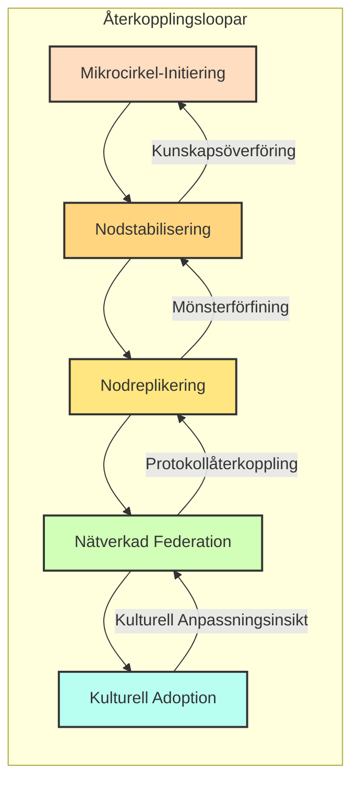

# STRUKTUR.md

**Version:** 1.0  
**Datum:** 15 februari 2026  
**Status:** Operativt Kärnramverk  
**Syfte:** Definiera de minimala strukturella villkoren för att Flödet ska existera och förbli stabilt i alla sammanhang.
**Kritisk Notering:** Detta dokument är självtillräckligt. Grundares närvaro krävs inte.  

---

## HUR MAN ANVÄNDER DETTA DOKUMENT

- Läs invarianter först → definierar vad som inte kan brytas
- Läs spiralfaser → definierar hur Flödet växer
- Läs misslyckanden → definierar vad man ska bevaka
- Använd anpassningsriktlinjer → tillämpa lokalt

Detta dokument räcker för att påbörja implementering.

---

## FÖRORD

FLÖDET är inte ett projekt knutet till någon enskild individ.  
Det är ett **globalt, anpassningsbart ramverk** utformat för att fungera i alla politiska sammanhang: demokratier, monarkier, enpartistater, federationer, stamsamhällen, teokratier och hybridregimer.  

**Detta dokument förutsätter:**
- Läsare kan verka i sammanhang som sträcker sig från Bangladesh till Kina, från Norge till Nigeria, från Kuba till Tanzania.  
- Juridiska, sociala och ekonomiska förhållanden varierar, och FLÖDET måste anpassa sig utan att kompromissa sina kärnprinciper.  
- Grundare eller ursprunglig arkitekt BÖR vara frånvarande; systemet måste fungera autonomt.  

---

## 1. STRUKTURELLA INVARIANTER

Dessa måste existera i VARJE giltig Flöde-implementering. Om någon bryts = systemkollaps:

1. **Baslinjesäkerhet:** Alla deltagare har tillgång till livets väsentligheter oberoende av sammanhang.  
2. **Inget Tvång:** Deltagande är frivilligt, utan extern eller intern press.  
3. **Konfliktmetabolism:** Tvister löses konstruktivt, inte undertrycks.  
4. **Rollrotation:** Inga permanenta ledare; ansvar cirkulerar.  
5. **Grundarirrelevans:** Systemet måste fungera fullt ut utan beroende av någon grundare.  
6. **Regenerativ Orientering:** FLÖDES-interaktioner måste återställa resurser, relationer och system snarare än uttömma dem.  
7. **Transparens Utan Övervakning:** Data aggregeras; individer spåras aldrig för kontroll.  

---

## 2. POLITISK REALISM

FLÖDET måste förutse och anpassa sig till **alla politiska system**:
  
- **Demokratiska Sammanhang:** Betona transparens, deltagande och lagefterlevnad.  
- **Internationella Noder:** Protokoll måste vara flexibla för gränsöverskridande juridiska och kulturella skillnader.  
- **Global Inramning:** Använd neutral terminologi ("gemenskapsprojekt", "experimentellt kooperativ") för att undvika misstolkning eller förtryck.  

**Operativ Princip:** FLÖDET är aldrig konfrontativt mot politisk auktoritet. Anpassning > Ideologi.

---

## 3. SPIRALFASMEKANISM

FLÖDET expanderar och konsolideras via **spiralloopar**:

1. **Mikrocirkel-Initiering (0–2 år):** Små grupper (3–12 deltagare) testar resursdelning, konfliktprotokoll och förtroendemekanismer.  
2. **Nodstabilisering (2–5 år):** Medelstora noder (20–60 deltagare) implementerar styrning, lagefterlevnad och redundans.  
3. **Nodreplikering (5–10 år):** Oberoende noder duplicerar protokoll autonomt. 
4. **Nätverkad Federation (10–20 år):** Regionala nätverk koordinerar resurser och kunskap utan central auktoritet.  
5. **Kulturell Adoption (20+ år):** Protokoll diffunderar globalt, oberoende av grundare, och anpassar sig till lokala politiska verkligheter.  

**Kärnregel:** Ingen fas hoppas över; expansion sker endast efter att stabilitet och dokumentation validerats.  

---

## 4. KUNSKAPSÖVERFÖRING

**Dokumentation är väsentlig**:

- Varje fas måste producera **överförbar, neutral dokumentation**.  
- Protokoll måste **förutse grundares frånvaro**.  
- Kunskapsöverföring inkluderar skriftliga, muntliga och digitala medier lämpliga för olika läskunnighets- och teknologiska sammanhang.  

**Återkopplingsloopar:** Misslyckanden dokumenteras, lösningar standardiseras och lokala anpassningar delas mellan noder.  

---

## 5. GLOBALA FRAMGÅNGSMÅTT

**Mät aldrig:**
- Individuellt värde, emotionell form, ideologisk efterlevnad, social hierarki eller produktivitetstempo.  

**Mät alltid:**
- Resursregeneration, baslinjesäkerhet, förtroendestabilitet, rollredundans, konfliktlösningseffektivitet, energihållbarhet och dokumentationskvalitet.  

**Princip:** Mått återspeglar **systemhälsa**, inte mänsklig prestation.  

---

## 6. MISSLYCKANDEN & BEGRÄNSNING

FLÖDET är robust endast om potentiella misslyckanden förstås:

- **Grundarberoende:** Begränsa med fullständig rolldokumentation och delegering.  
- **Kulturell Drift:** Kärnprinciper är abstrakta; lokal anpassning är tillåten utan att bryta invarianter.  
- **Regleringsinfångande:** Lagefterlevnad uppnås utan central auktoritet.  
- **Resursolikhet:** Transparens- och solidaritetsmekanismer förhindrar dominanshierarkier.  
- **Synlighetsrisk i Auktoritära Stater:** Verksamhet förblir diskret; inramning undviker ideologisk exponering.  

---

## 7. ANPASSNINGSRIKTLINJER

**Kärnprinciper är oföränderliga.**  
**Allt annat kan anpassas:**
- Styrningsstrukturer, kommunikationsmetoder, resursredovisning, infrastrukturlayouter, professionella integrationer och tidslinjer.  

**Valideringsfrågor för Lokal Anpassning:**
1. Är kärnprinciperna intakta?  
2. Är baslinjen säkerställd?  
3. Kan deltagare lämna fritt?  
4. Finns det inget permanent ledarskap?  
5. Metaboliseras konflikter effektivt?  
6. Är systemet regenerativt?  
7. Kan systemet fungera utan grundaren?  

---

## 8. SPIRALÅTERKOPPLINGSDIAGRAM

Dokumentstatus: Levande ramverk
Förväntad Livslängd: Decennier till århundraden om varaktig
Ändringsprotokoll: Förgrena, anpassa, dokumentera, dela
Framgångsmått: FLÖDET verkar autonomt världsvid utan grundaringripande

🌀💚🌍
