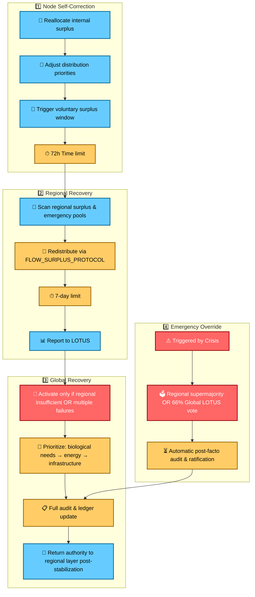

# LOTUS BASELINE RECOVERY CHECKLIST
## Quick Reference for Recovery Actions

**Reference:** `BASELINE_RECOVERY_PROTOCOL.md` v1.1  
**Purpose:** Ensure all Baseline violations are handled correctly, auditable, and traceable.

---

## 1. Identify Violation
- [ ] Node(s) below Global Baseline metric (energy, food, water, space, time, air, electricity)  
- [ ] Verified via: Self-declaration / Peer confirmation / Sensor validation / LOTUS dispute confirmation  
- [ ] Timestamp and log created in `/compostandgrowth/baseline_violations/`  

---

## 2. Determine Recovery Level
- [ ] **Level 1 – Node Self-Correction** (72h limit)  
  - Internal surplus reallocation  
  - Distribution adjustment  
  - Voluntary surplus window triggered  
- [ ] **Level 2 – Regional Recovery** (7-day limit)  
  - Scan regional surplus nodes & emergency pools  
  - Redistribute via `FLOW_SURPLUS_PROTOCOL.md`  
  - Report to LOTUS at day 3 and day 7  
- [ ] **Level 3 – Global Recovery**  
  - Activate only if regional insufficient or multiple regional failures  
  - Prioritize: biological needs → energy stability → infrastructure repair  
  - Audit & log full redistribution

---

## 3. Emergency Override
- [ ] Triggered by: War / Planetary Disaster / Grid Collapse / Regional Governance Failure  
- [ ] Requires: Regional LOTUS supermajority OR 66% Global LOTUS override  
- [ ] Log justification & timestamp  
- [ ] Automatic post-facto audit & ratification

---

## 4. Monitoring & Reporting
- [ ] Node: Progress report at 24/48/72h  
- [ ] Regional: KPI & audit logs at day 3 & day 7  
- [ ] Global: Full audit and ledger update  
- [ ] Metrics linked to thresholds in `RISK_MANAGEMENT.md`

---

## 5. Data Privacy
- [ ] Public: number of violations, regional recovery rates, global interventions  
- [ ] Private: individual/household-level data anonymized in all reports

---

## 6. Completion Status
- [ ] Action marked as: Mitigated / Escalated / Resolved  
- [ ] All logs linked and stored in `/compostandgrowth/baseline_violations/`  
- [ ] LOTUS confirms closure

---

✅ **All items checked → Baseline violation properly resolved and auditable**

