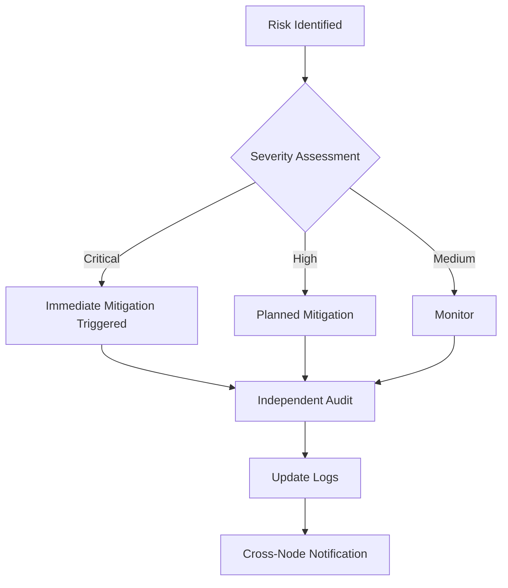

# ⚠️ RISK_MANAGEMENT.md

**Status:** CORE FRAMEWORK  
**Layer:** System Integrity (Layer II – Operational Containment)  
**Scope:** Node → Regional → Global  
**Purpose:** Explicitly identify system weaknesses, assign mitigations, and create a living self-test mechanism.  
**Version:** 1.2  
**Authors:** Claude & Elinor Frejd  
**Date:** February 26, 2026  

---

# 1. Overview

This document defines the formal threat model and mitigation structure for M-OS-R.

It functions as:

- A systemic vulnerability registry  
- A mitigation assignment ledger  
- A structural stress-test layer  
- A failure observability guarantee  

RISK_MANAGEMENT.md does not replace constitutional invariants.  
It exists to prevent operational drift toward invariant violation.

All risks must remain visible.  
Invisible risk is systemic decay.

---

# 2. Threat Model Summary

M-OS-R assumes adversarial and entropy-driven environments.

Threat categories:

1. Identity capture  
2. Governance distortion  
3. Enforcement drift  
4. Network failure  
5. Energy collapse  
6. Procedural corruption  
7. Coordinated cross-node manipulation  
8. Slow structural centralization  

The system assumes:

- Nodes may fail.  
- Leaders may drift.  
- Logs may be attacked.  
- Verification may be gamed.  
- Energy may become scarce.  
- External political pressure may increase.  

Risk management must not assume permanent good faith.

---

# 3. Risk Categories

---

## 3.1 Identity & Verification

| Risk | Severity | Owner | Mitigation | Status |
|------|----------|--------|------------|--------|
| Randomized Social Verification Weakness | Critical | Node Leads | Multi-layer verification; anomaly logging | Not started |
| Privilege Escalation via Device Compromise | High | Node Leads + Dev | Device trust scoring; decay model | Not started |
| Reduced Privileges for Non-Secure Devices | High | LOTUS | Dynamic privilege reassessment | In pilot |
| Recovery Set Without Incentive | Medium | Node Leads | Defined activation thresholds | Not started |
| Identity Lifecycle Drift | High | Governance Layer | Enforce FLOW_ID_LIFECYCLE audit triggers | Not started |

---

## 3.2 Governance & Compliance

| Risk | Severity | Owner | Mitigation | Status |
|------|----------|--------|------------|--------|
| SLA Timing Challenges | High | Regional Leads | Standardized response windows | Not started |
| Conflicting Decisions Across Nodes | Medium | LOTUS | Cross-node arbitration | Not started |
| Sanction Escalation Drift | Critical | Oversight Panel | Hard caps; audit triggers | Not started |
| Governance Capture | Critical | Federated Oversight | Term limits; random panel rotation | Not started |
| Informal Power Accumulation | High | All Nodes | Mandatory transparency logs | Not started |

---

## 3.3 Technical & Operational

| Risk | Severity | Owner | Mitigation | Status |
|------|----------|--------|------------|--------|
| Network Partition | Critical | Dev Team | Mesh fallback mode | Not started |
| Log Corruption | Critical | Dev Team | Hash chaining; mirrored logs | Not started |
| RNG Manipulation | Critical | LOTUS + Dev | Public deterministic RNG logging | Not started |
| Energy Scarcity Impact | High | Node Leads | Graceful degradation protocols | In pilot |
| Version Incompatibility | Medium | Governance | Strict versioning policy | Active |

---

## 3.4 Structural Drift & Systemic Risks

| Risk | Severity | Owner | Mitigation | Status |
|------|----------|--------|------------|--------|
| Slow Centralization | Critical | Constitutional Layer | Exit protection; federation autonomy | Ongoing |
| Enforcement Permanence | Critical | Oversight | Mandatory sunset clauses | Not started |
| Amendment Abuse | High | LOTUS | Multi-stage amendment thresholds | Not started |
| Inter-Node Imbalance | High | Regional Nodes | Resource normalization review | Not started |
| Trust Erosion | High | All Layers | Transparent review cycles | Ongoing |

---

# 4. Interdependency Amplification

Risks are interconnected.

Examples:

- Weak identity verification increases sanction misuse probability.
- Network partition increases governance capture risk.
- Energy scarcity increases centralization pressure.
- Log corruption invalidates enforcement legitimacy.
- Amendment abuse risks constitutional erosion.

Mitigations must consider amplification effects.

---

# 5. Mitigation Requirements

All risk entries must include:

1. Explicit owner  
2. Defined activation trigger  
3. Review frequency  
4. Protocol linkage  
5. Audit traceability  

Mitigation must be testable.

---

# 6. Escalation Logic

Critical risks require:

- Immediate containment
- Independent audit
- Cross-node visibility

---

# 7. Review Cycles

Risk review occurs:

- Annually (LOTUS review cycle)
- After major amendment
- After sanction escalation
- After network disruption
- After federation restructuring

Review cannot be indefinitely deferred.

---

# 8. Failure State Doctrine

M-OS-R assumes:

Failure is possible.  
Capture is possible.  
Corruption is possible.  

Therefore:

- Exit must remain operational.
- Federation must remain optional.
- Sanctions must expire.
- Amendments must follow process.
- Logs must remain auditable.

A system that cannot detect its own failure is already failing.

---

# 9. Living Document Clause

New risks must be logged before mitigation.

Deletion of risk entries is prohibited.

Entries may only be marked:

- Mitigated  
- Deprecated  
- Absorbed  
- Resolved (with audit reference)

Risk memory must persist.

---

# 10. Initial Baseline Thresholds (v1.0)

These thresholds exist to protect against power accumulation and structural drift.  
They may be adjusted through `BASELINE_AMENDMENT_PROTOCOL.md` after formal review.

---

## 10.1 Log Integrity Trigger

Any confirmed hash mismatch between mirrored logs  
→ Automatic audit initiation within 24 hours.

No tolerance band is permitted.

---

## 10.2 Sanction Duration Guardrail

- Any sanction exceeding 30 days  
  → Mandatory cross-node review.

- Any sanction exceeding 90 days  
  → Automatic LOTUS escalation.

Sanctions must not become indefinite by inertia.

---

## 10.3 Governance Concentration Trigger

If more than 50% of dispute resolutions originate from a single node within a rolling 6-month window  
→ Federation balancing review required.

This does not invalidate decisions but triggers structural analysis.

---

## 10.4 Amendment Velocity Trigger

If more than 3 constitutional amendment proposals occur within 12 months  
→ Mandatory cooling-off period before further proposals.

Prevents structural instability via rapid change.

---

Thresholds are protective, not punitive.

They are designed to:

- Prevent drift
- Slow capture
- Preserve reversibility
- Maintain auditability

They are not ideological.

They are structural stabilizers.

---