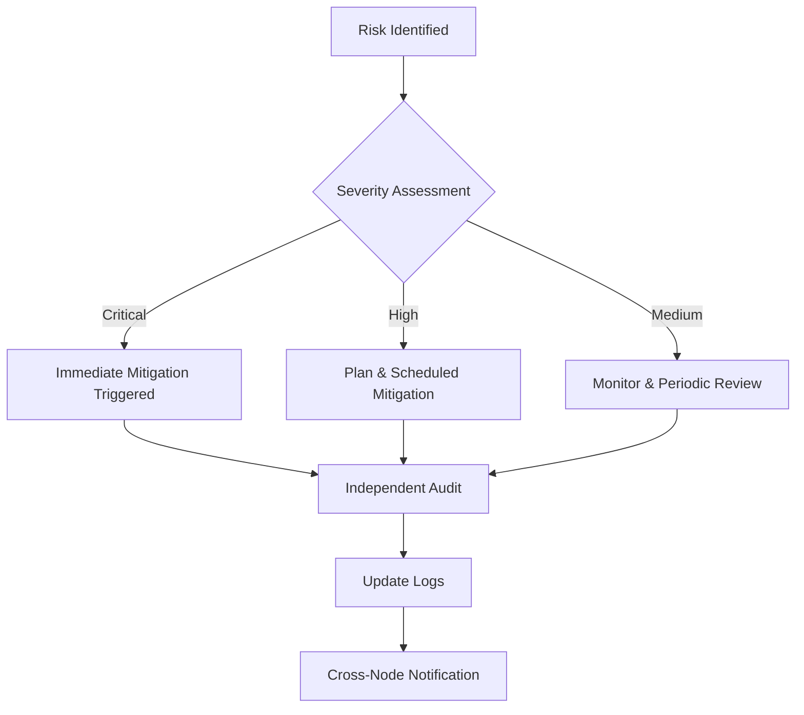

# ⚠️ RISK_MANAGEMENT.md

**Status:** CORE FRAMEWORK  
**Layer:** System Integrity (Layer II – Operational Containment)  
**Scope:** Node → Regional → Global  
**Purpose:** Explicitly identify system weaknesses, assign mitigations, and create a living self-test mechanism.  
**Version:** 1.1  
**Authors:** Claude & Elinor Frejd  
**Date:** February 26, 2026  

---

# 1. Overview

This document defines the formal threat model and mitigation structure for M-OS-R.

It functions as:

- A systemic vulnerability registry  
- A mitigation assignment ledger  
- A structural stress-test layer  
- A failure observability guarantee  

RISK_MANAGEMENT.md does not replace constitutional invariants.  
It exists to prevent operational drift toward invariant violation.

All risks must remain visible.  
Invisible risk is systemic decay.

---

# 2. Threat Model Summary

M-OS-R assumes adversarial and entropy-driven environments.

Threats are categorized as:

1. Identity capture
2. Governance distortion
3. Enforcement drift
4. Network failure
5. Energy collapse
6. Procedural corruption
7. Coordinated cross-node manipulation
8. Slow structural centralization

The system assumes:

- Nodes may fail.
- Leaders may drift.
- Logs may be attacked.
- Verification may be gamed.
- Energy may become scarce.
- External political pressure may increase.

Risk management must not assume good faith as a permanent property.

---

# 3. Risk Categories

---

## 3.1 Identity & Verification

| Risk | Severity | Owner | Mitigation | Status |
|------|----------|--------|------------|--------|
| Randomized Social Verification Weakness | Critical | Node Leads | Multi-layer verification; reputation weighting; anomaly logging | Not started |
| Privilege Escalation via Device Compromise | High | Node Leads + Dev | Hardware trust layers; device decay scoring | Not started |
| Reduced Privileges for Non-Secure Devices | High | LOTUS | Dynamic privilege reassessment; periodic audits | In pilot |
| Recovery Set Without Incentive | Medium | Node Leads | Define activation thresholds; incentive alignment | Not started |
| Identity Lifecycle Drift | High | Governance Layer | Enforce FLOW_ID_LIFECYCLE.md audit triggers | Not started |

Primary dependency: `FLOW_ID.md`, `FLOW_ID_LIFECYCLE.md`

---

## 3.2 Governance & Compliance

| Risk | Severity | Owner | Mitigation | Status |
|------|----------|--------|------------|--------|
| SLA Timing Challenges | High | Regional Leads | Standardized response windows; automated reminders | Not started |
| Conflicting Decisions Across Nodes | Medium | LOTUS | Mirror logs; cross-node arbitration | Not started |
| Sanction Escalation Drift | Critical | Oversight Panel | Hard caps; audit triggers; forced review | Not started |
| Governance Capture | Critical | Federated Oversight | Term limits; random panel rotation (LOTUS) | Not started |
| Informal Power Accumulation | High | All Nodes | Mandatory transparency; audit trails | Not started |

Primary dependency: `LOTUS_PROTOCOL.md`, `SANCTION_PROTOCOL.md`, `POWER_AND_ENFORCEMENT.md`

---

## 3.3 Technical & Operational

| Risk | Severity | Owner | Mitigation | Status |
|------|----------|--------|------------|--------|
| Network Partition | Critical | Dev Team | Mesh resilience; offline fallback mode | Not started |
| Log Corruption | Critical | Dev Team | Hash chaining; mirrored logs | Not started |
| RNG Manipulation | Critical | LOTUS + Dev | Deterministic public RNG logs (`RNG_AND_LOG_SPEC.md`) | Not started |
| Energy Scarcity Impact | High | Node Leads | Graceful degradation; energy-aware scheduling | In pilot |
| Version Incompatibility | Medium | Governance | Strict versioning & compost tracking | Active |

Primary dependency: `RNG_AND_LOG_SPEC.md`, `VERSIONING_AND_COMPOST_POLICY.md`

---

## 3.4 Structural Drift & Systemic Risks

| Risk | Severity | Owner | Mitigation | Status |
|------|----------|--------|------------|--------|
| Slow Centralization | Critical | Constitutional Layer | Mandatory exit protection; federation autonomy | Ongoing |
| Enforcement Permanence | Critical | Oversight | Automatic sunset clauses | Not started |
| Amendment Abuse | High | LOTUS | Multi-stage amendment thresholds | Not started |
| Inter-Node Economic Imbalance | High | Regional Nodes | Resource metric normalization | Not started |
| Trust Erosion | High | All Layers | Transparent logs; visible review cycles | Ongoing |

Primary dependency: `BASELINE_AMENDMENT_PROTOCOL.md`, `RESOURCE_METRIC_STANDARDS.md`

---

# 4. Interdependency Amplification

Risks are not isolated.

Examples:

- Weak identity verification increases sanction misuse probability.
- Network partition increases governance capture risk.
- Energy scarcity increases centralization pressure.
- Log corruption invalidates enforcement legitimacy.
- Amendment abuse risks constitutional erosion.

Mitigation strategies must consider cross-category amplification.

---

# 5. Mitigation Guidelines

All risks must include:

1. Explicit owner (Node, Regional, LOTUS, Dev, Oversight).
2. Defined activation triggers (quantitative where possible).
3. Review frequency (event-triggered or scheduled).
4. Protocol linkage (which document governs mitigation).
5. Audit traceability (log references required).

Mitigation must be testable.

Non-testable mitigation is symbolic.

---

# 6. Escalation Logic

Critical risks must:

- Trigger immediate containment.
- Produce audit logs.
- Be reviewed by external node or LOTUS.

---

# 7. Review Cycles

Risk review occurs:

- Annually (LOTUS global review)
- After major amendment
- After sanction escalation event
- After network disruption
- After federation restructuring

Review cannot be indefinitely deferred.

---

# 8. Failure State Doctrine

M-OS-R assumes:

Failure is possible.  
Capture is possible.  
Corruption is possible.  

Therefore:

- Exit must remain operational.
- Federation must remain optional.
- Sanctions must expire.
- Amendments must be reversible where possible.
- Logs must be auditable.

A system that cannot detect its own failure is already failing.

---

# 9. Living Document Clause

This document is version-controlled under `VERSIONING_AND_COMPOST_POLICY.md`.

New risks must be logged before mitigation.

Deletion of risk entries is prohibited.  
They may only be marked as:

- Mitigated
- Deprecated
- Absorbed
- Resolved (with audit reference)

Risk memory must persist.

---
