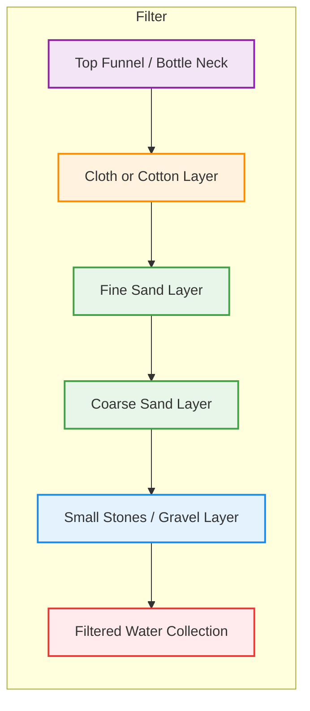

# 🌊 Water Filtration Guide
**Ensuring Local Clean Water Without Profit Barriers**

---

## 1️⃣ Principles

Water must be **safe from four threats**:

1. Large particles (sand, dirt, debris)  
2. Chemical contaminants (heavy metals, pesticides)  
3. Microorganisms (bacteria, viruses, parasites)  
4. Taste and odor

This guide focuses on **practical, locally replicable methods** using inexpensive or free materials.

---

## 2️⃣ Materials

- Plastic bottles or buckets  
- Sand, gravel, small stones  
- Activated charcoal (can be made from wood, coconut shells, or charcoal from fires)  
- Cloth, cotton, or coffee filters  
- Sunlight or heat source (fire, stove, solar)

---

## 3️⃣ Step-by-Step Filtration

### A. Mechanical Filtration (Particles)

1. Cut a plastic bottle in half; use the top as a funnel.  
2. Layer materials inside (bottom to top):  
   - Coarse gravel  
   - Fine sand  
   - Cloth or cotton  
3. Slowly pour water through the filter.  
4. Outcome: visibly clear water. **Microorganisms remain at this stage.**  

**Tip:** Keep filter layers clean; replace periodically.

---

### B. Microbial Filtration (Pathogens)

#### 1. Boiling
- Boil water for **at least 5 minutes** to kill bacteria, viruses, and parasites.  
- Higher altitudes may require longer boiling.  

#### 2. Solar Disinfection (SODIS)
- Fill clear PET bottles with water.  
- Expose to **direct sunlight for 6–8 hours** (up to 2 days in cloudy conditions).  
- UV rays neutralize microorganisms.  
- Ideal for small volumes when fuel or stoves are scarce.  

---

### C. Taste and Chemical Improvement

- **Activated charcoal** binds chemical contaminants and improves flavor:  
  - Crush charcoal, rinse, place in filter above sand layer.  
- **Slow filtration** allows water to interact with charcoal and sand for several hours.  

---

### D. Combined Method

**Recommended order for maximum safety and taste:**

`Mechanical → Activated Charcoal → Boiling → SODIS (optional backup)`

- Produces drinkable water without chemicals.  
- Suitable for **Flow Node Circles** and local communities.

---

**🔥 HOW TO MAKE ACTIVATED CHARCOAL**

For water filtration, medicine, and soil regeneration

Status: Practical DIY Protocol
Materials: Wood (hardwood preferred), metal container with lid, fire source
Time: 4-6 hours (mostly waiting)
Difficulty: Medium (requires fire safety)

---

WHY MAKE YOUR OWN ACTIVATED CHARCOAL?

Activated charcoal is a powerful, natural filter. It:

- Binds chemical contaminants (pesticides, chlorine, some heavy metals)
- Removes bad tastes and odors
- Can be used in water filters, for first aid (poison absorption), and to improve soil

Store-bought activated charcoal is expensive and often packaged in plastic.
Making your own is cheap, low-tech, and uses materials you already have.

---

THE SCIENCE IN ONE SENTENCE

Wood contains microscopic pores. When heated without oxygen (pyrolysis), it turns into charcoal.
Activation opens those pores further, creating a massive surface area—a single gram can have over 1,000 square meters of surface area. That's what makes it so effective at trapping impurities.

---

STEP 1: MAKE CHARCOAL (Pyrolysis)

You cannot just burn wood in open air—that gives you ash, not charcoal. You need to heat the wood without oxygen.

What you need:

- Hardwood (oak, birch, maple, fruit tree wood – no softwoods like pine, they contain resins)
- A metal container with a tight-fitting lid (old paint can, large tin can, metal bucket)
- A fire source (campfire, barbecue grill, outdoor fire pit)
- Long metal tongs or thick gloves

Method A: The Can Method (Small Batches)

1. Cut wood into small pieces (2-5 cm thick). Remove bark if possible.
2. Fill the metal container with wood pieces. Pack tightly, but leave a little space.
3. Put the lid on TIGHTLY. The goal is to keep oxygen out. If you have a small hole, cover it with clay or mud.
4. Place the container in the middle of a hot fire. Build the fire around it.
5. Let it burn for 3-5 hours. You'll see smoke and possibly flames from the container – that's normal. Gases are escaping.
6. Remove the container with tongs. Let it cool COMPLETELY before opening (several hours). If you open it while hot, the charcoal will catch fire.

Method B: The Hole Method (Larger Batches)

1. Dig a hole in the ground (about 50 cm deep).
2. Line the bottom with dry wood and light it.
3. Add more wood as the fire builds. Let it burn until you have a bed of red-hot coals.
4. Cover the coals completely with a thick layer of dry soil (5-10 cm). This cuts off oxygen.
5. Wait 12-24 hours. The coals will slowly turn to charcoal underground.
6. Dig it up. You now have charcoal.

---

STEP 2: CRUSH THE CHARCOAL

Once the charcoal is completely cool:

1. Put it in a strong bag (old pillowcase, burlap sack).
2. Crush it with a hammer or heavy object. You want small pieces, not powder.
3. Sieve it. Keep pieces between 1-5 mm for water filters. Save the powder for other uses (soil, medicine).

Wear a dust mask – charcoal dust is not good for your lungs.

---

STEP 3: ACTIVATE THE CHARCOAL (The Critical Step)

Raw charcoal has some filtering ability. Activation makes it 100x more effective by opening the pores.

What you need:

- Crushed charcoal
- Calcium chloride (can be bought as de-icer, or made by boiling eggshells in vinegar – see appendix)
- OR lemon juice (weak but works)
- Water
- A metal container (old pot you don't care about)
- Fire source

Method:

1. Make an activating solution:
   - Mix 25% calcium chloride with 75% water.
          Example: 250g calcium chloride + 750ml water.
   - OR use concentrated lemon juice (not as strong, but works in emergencies).
2. Soak the charcoal:
   - Put crushed charcoal in the container.
   - Pour the activating solution over it until fully covered.
   - Stir well.
   - Let it soak for 24 hours. Stir occasionally.
3. Drain and rinse:
   - Pour off the liquid (can be reused once or twice).
   - Rinse the charcoal thoroughly with clean water to remove any remaining chemical.
4. Dry the charcoal:
   - Spread it on a tray in the sun, or
   - Dry it in an oven at very low heat (100°C) until completely dry.
5. Re-activate with heat (optional but recommended):
   - Put the dry charcoal back in a sealed metal container.
   - Heat it in a fire for another 1-2 hours.
   - Let it cool completely before opening.

This last heating step drives off anything absorbed during soaking and fully opens the pores.

---

STEP 4: TEST YOUR ACTIVATED CHARCOAL

Simple test: Put a teaspoon of your charcoal in a glass of water with a few drops of food coloring. Stir for 5 minutes. If the water becomes clear, your charcoal works. If not, repeat the activation process.

---

HOW TO USE IT IN A WATER FILTER

In the Flow Node Water Filter Guide, place your activated charcoal:

- Between the fine sand and the cloth/cotton layer.
- Make sure water flows SLOWLY through the charcoal layer (fast flow = less filtering).

Replace the charcoal every 2-3 months, or sooner if water flow slows down (pores are clogged).

---

OTHER USES FOR ACTIVATED CHARCOAL

- First aid: Mix with water to make a paste for poison emergencies (see Emergency Medicine guide).
- Soil improvement: Mix into garden soil – it improves water retention and provides habitat for beneficial microbes.
- Odor removal: Place dry charcoal in a cloth bag in the fridge, closet, or bathroom.

---

APPENDIX: MAKE YOUR OWN CALCIUM CHLORIDE

If you can't buy calcium chloride, you can make a weak version:

1. Save eggshells. Clean and dry them.
2. Crush them into small pieces.
3. Cover with white vinegar in a glass jar.
4. Let it sit for 24 hours. It will bubble (that's the reaction).
5. Strain out the liquid. This liquid contains calcium acetate – not as strong as calcium chloride, but works for emergency activation.

---

SAFETY NOTES

- Work outdoors or in very well-ventilated areas.
- Wear gloves and eye protection when handling chemicals.
- Never open the hot container – the charcoal can ignite instantly.
- Store activated charcoal in a dry place. Once activated, it will absorb moisture from the air.

---

FINAL WORD

Making your own activated charcoal is not difficult. It takes time and attention, but the result is a powerful, reusable tool for clean water, health, and soil.

Every batch you make increases your skills and your independence.

"The best filter is the one you can make yourself."

🌿🔥💧

### E. Maintenance

- Replace sand and gravel regularly  
- Clean all containers and filters  
- Store filtered water in clean containers  
- Check smell and taste; reboil if off

---

## 4️⃣ Flow Node Implementation Tips

- Document local sources and filter designs.  
- Share designs and best practices within the Circle.  
- Build multiple small filters to enable replication by others.  
- Encourage autonomy: anyone can maintain their own clean water.  

---

> **Note:** This is a practical, low-tech guide. Infrastructure, energy, and coordination are needed for larger scale deployment, but local sufficiency is always possible without profit or licensing barriers.

## 🌊 Flow Node Water Filter Diagram



Explanation of Layers (Top → Bottom):

1. Funnel / Bottle Neck – guides water into the filter.
2. Cloth / Cotton Layer – traps fine debris and prevents sand from escaping.
3. Fine Sand Layer – captures smaller particles.
4. Coarse Sand Layer – supports fine sand, slows flow.
5. Gravel / Small Stones – prevents clogging, distributes water evenly.
6. Collection – clean water collects here, ready for boiling, SODIS, or direct use.

> This diagram visualizes a simple, locally replicable water filtration system for Flow Node Circles. 
> Combine with boiling or solar disinfection for microbial safety.

## 🌊 Flow Node Water Filter Guide

```text
Water Filter Layers (Top → Bottom) for Flow Node Circles:

       ┌───────────────┐
       │ Funnel / Neck │  ← guides water into filter
       ├───────────────┤
       │ Cloth / Cotton│  ← traps fine debris, keeps sand in place
       ├───────────────┤
       │  Fine Sand    │  ← captures smaller particles
       ├───────────────┤
       │ Coarse Sand   │  ← supports fine sand, slows flow
       ├───────────────┤
       │ Gravel / Stones│ ← prevents clogging, distributes water evenly
       ├───────────────┤
       │ Collection    │  ← clean water ready for boiling, SODIS, or direct use
       └───────────────┘
```

Explanation of Layers:

1. Funnel / Bottle Neck – guides water into the filter.
2. Cloth / Cotton Layer – traps fine debris and prevents sand from escaping.
3. Fine Sand Layer – captures smaller particles.
4. Coarse Sand Layer – supports fine sand, slows flow.
5. Gravel / Small Stones – prevents clogging, distributes water evenly.
6. Collection – clean water collects here, ready for boiling, SODIS, or direct use.

> This diagram visualizes a simple, locally replicable water filtration system for Flow Node Circles. 
> Combine with boiling or solar disinfection for microbial safety. 

## 🌊 Flow Node Water Filter Guide (Expanded)

```text
Water Flow Through a Simple Filter (Top → Bottom):

        ┌───────────────┐
        │ Funnel / Neck │  ← guides water into filter
        └───────┬───────┘
                │
                ▼
        ┌───────────────┐
        │ Cloth / Cotton│  ← traps fine debris, keeps sand in place
        └───────┬───────┘
                │
                ▼
        ┌───────────────┐
        │  Fine Sand    │  ← captures smaller particles
        └───────┬───────┘
                │
                ▼
        ┌───────────────┐
        │ Coarse Sand   │  ← supports fine sand, slows flow
        └───────┬───────┘
                │
                ▼
        ┌───────────────┐
        │ Gravel / Stones│ ← prevents clogging, distributes water evenly
        └───────┬───────┘
                │
                ▼
        ┌───────────────┐
        │  Collection   │  ← clean water collects here
        └───────┬───────┘
                │
   ┌────────────┴────────────┐
   │ Optional: Disinfect      │
   │ 1. Boiling (≥1 min)     │
   │ 2. SODIS (6h+ sunlight) │
   └─────────────────────────┘
```
Explanation of Layers:

1. Funnel / Bottle Neck – directs water into filter efficiently.
2. Cloth / Cotton Layer – stops fine debris and prevents sand from escaping.
3. Fine Sand Layer – removes smaller particles.
4. Coarse Sand Layer – supports fine sand and slows water flow for better filtration.
5. Gravel / Small Stones – prevents clogging and distributes water evenly across layers.
6. Collection – water gathers here, ready for further microbial disinfection.
7. Optional Disinfection – boiling or SODIS ensures water is safe to drink.

💡 Notes:
- Combine with **boiling or SODIS** for microbial safety.
- Materials are locally available and replicable in Flow Node Circles.
- System emphasizes **local capacity sufficiency**: anyone with energy, knowledge, and basic tools can implement it.