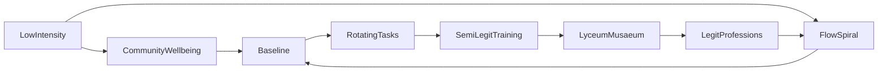

# FLOW_HUMAN_INFRASTRUCTURE_HWA_EXTENDED.md
*Human Work Architecture – Rotating Task System with Implicit Contributions*

---

## 1. Purpose
- Describe the **rotating work system for Flow**, including:
  - Fully legitimated professions
  - Semi-legit roles
  - Fully rotating tasks
  - Implicit or low-intensity contributions
- Audience:
  - Node participants
  - Organizers
  - Lyceum educators
  - External reviewers

---

## 2. Principles
- **All tasks rotate** except for fully legitimated professions.
- **Baseline access** remains guaranteed, independent of contribution type.
- **Work hours** are tracked for coordination, fairness, and learning—but not survival.
- **Implicit contributions** (small acts of care, presence, or creativity) are **valued and recorded qualitatively**.
- Safety and mentorship remain top priority for high-risk tasks.

---

## 3. Legitimate Professions
- Doctors, nurses, midwives, psychologists, physiotherapists, engineers, lab specialists
- Work is **not rotated across the population**; rotation occurs **within professional group** if needed.
- Training via Lyceum Musaeum, mentorship, and structured knowledge transfer.

---

## 4. Semi-Legit Professions
- Require experience, skill, or supervision; partially rotated:
  - Teachers / Educators
  - Junior technicians
  - Apprentice engineers / builders
  - Node coordinators for specialized tasks
- Rotation guided by mentorship and capacity
- Progression tracked in Flow Spiral

---

## 5. Fully Rotating Tasks
- Examples:
  - Food preparation, gardening, hydroponics
  - Cleaning, maintenance, logistics
  - Non-specialized construction and assembly
  - Peer mentoring, administrative support
- **Rotation ensures fairness**, prevents burnout, and builds collective skill.
- Hours tracked for coordination; experience mapped in Flow Spiral.

---

## 6. Implicit / Low-Intensity Contributions
- **Definition:** acts that contribute to Flow and community health without formal assignment or hours
- **Examples:**
  - Playing football or games with children
  - Artistic or creative acts (painting, music, crafts)
  - Social support: listening, emotional presence, small gestures
  - Observational learning and documentation
- **Principles:**
  - Voluntary and non-coercive
  - Impact recognized qualitatively in Flow Spiral
  - Encourages diverse expression of participation
  - Contributes to community well-being, knowledge, and resilience

---

## 7. Lyceum Musaeum – Education Hub
- Practical workshops, mentoring, and simulations for legit and semi-legit roles
- Training includes **recognition of implicit contributions**:
  - Observation logs
  - Peer reflection circles
  - Optional documentation of creative or caring acts
- Ensures participants progress from low-intensity contribution → semi-legit → legit roles over time

---

## 8. Human Work Architecture – System Overview
- **Objective:** Integrate baseline, rotating tasks, semi-legit training, legit professions, and implicit contributions
- **Safety & oversight:** mentors supervise high-risk tasks
- **Documentation:** hours, qualitative notes, rotation logs, and Flow Spiral entries

---

## 9. Key Rules
1. Rotation universal except for fully legit professions  
2. Safety first: mentorship mandatory for high-risk tasks  
3. Baseline guaranteed: no access conditional on participation  
4. Progression from low-intensity → semi-legit → legit via Lyceum  
5. Hours tracked, but implicit contributions documented qualitatively  
6. Diversity of experience: participants rotate through formal tasks and contribute informally  
7. Feedback loops include qualitative assessment of low-intensity acts

---

## 10. Extended Mermaid Diagram

- **Legend:**
  - **RotatingTasks, SemiLegitTraining, LegitProfessions**: formal work
  - **LowIntensity**: implicit contributions
  - **FlowSpiral**: system tracking, learning, feedback
  - **CommunityWellbeing**: emergent social, emotional, and cultural impact

---

## 11. Notes
- Implicit contributions are **optional but valued**.
- Encourages diverse expressions of human participation.
- Maintains fairness, dignity, and inclusivity.
- Feedback and learning loops integrate both formal and informal contributions.

---