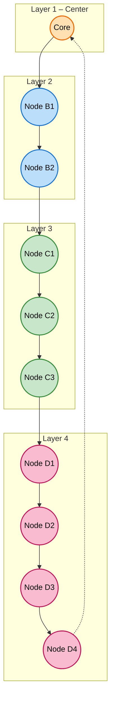

```mermaid
graph TD

%% SPIRAL LAYERS
subgraph L1[Layer 1 – Center]
A((Core))
end

subgraph L2[Layer 2]
B1((Node B1))
B2((Node B2))
end

subgraph L3[Layer 3]
C1((Node C1))
C2((Node C2))
C3((Node C3))
end

subgraph L4[Layer 4]
D1((Node D1))
D2((Node D2))
D3((Node D3))
D4((Node D4))
end

%% SPIRAL CONNECTIONS
A --> B1
B1 --> B2
B2 --> C1
C1 --> C2
C2 --> C3
C3 --> D1
D1 --> D2
D2 --> D3
D3 --> D4

%% OPTIONAL: LOOP BACK FOR SPIRAL FEEL
D4 -.-> A

%% COLORS
classDef core fill:#ffe0b2,stroke:#ef6c00,stroke-width:2px,color:#000;
classDef layer2 fill:#bbdefb,stroke:#1976d2,stroke-width:2px,color:#000;
classDef layer3 fill:#c8e6c9,stroke:#388e3c,stroke-width:2px,color:#000;
classDef layer4 fill:#f8bbd0,stroke:#c2185b,stroke-width:2px,color:#000;

class A core;
class B1,B2 layer2;
class C1,C2,C3 layer3;
class D1,D2,D3,D4 layer4;
```
